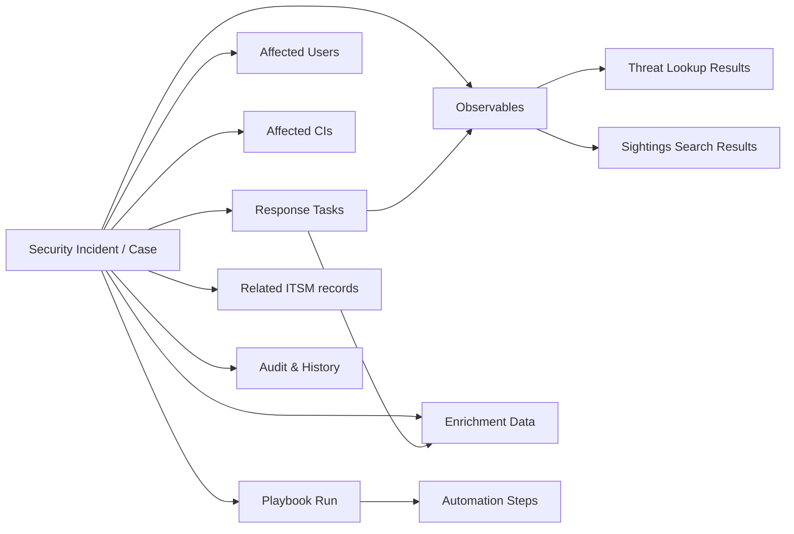
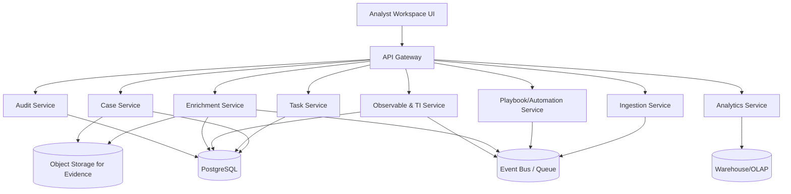

# Product Requirements Document for a ServiceNow-Like SOC Case Management Platform

## Executive summary and architecture philosophy

This PRD defines a greenfield Security Operations Center (SOC) case management platform, built from scratch, with feature parity to ServiceNow Security Incident Response (SIR / SIR Pro). The central product idea is to treat “security incidents” as first-class, workflow-driven work items that unify: triage inputs (alerts, phishing reports, inbound requests), investigation artifacts (observables, sightings, indicators), response execution (tasks, playbooks, orchestration), and governance (auditability, evidence, analytics). citeturn9view2turn18view4turn11view2turn15view2

ServiceNow’s architecture patterns that matter most for parity are:

- **Task-centric records with inheritable/common fields** (for assignment, SLA, work notes, lifecycle state, and reporting) plus product-specific fields layered on top. citeturn15view0turn16view0turn16view1  
- **A workspace-driven operating model** where “security incident” records aggregate related evidence and actions (response tasks, affected users/CIs, observables, enrichment data) into a single analyst workflow. citeturn12view0turn22view1turn15view2  
- **Process/lifecycle controls** (process definitions replacing older state mechanisms) that standardize phases such as Analysis and Contain through Closure, and ensure tasks and automation align with those phases. citeturn4view0  
- **Threat Intelligence as a shared substrate**: observables and indicators live in a reusable TI model, linked to security tasks/cases via many-to-many tables and enriched via capability-driven workflows. citeturn15view4turn18view2turn18view3turn19view0turn19view1  
- **Data ingest via import/transform patterns**: external systems write to an import table, and transform logic maps to the target incident table (including CI resolution heuristics). citeturn18view4  

This document also cross-validates these design patterns against open ecosystems: (a) **TheHive**’s case + tasks + observables model (including case templates), (b) Cortex’s “observable in → enrichment report out” analyzer abstraction, and (c) Shuffle’s API-first automation/workflow posture. citeturn23search4turn23search26turn23search5turn23search24turn23search18  

Because ServiceNow’s full table dictionaries are instance-resident, not exhaustively enumerated in public docs, this PRD distinguishes:  
- **Confirmed elements** (tables, relationships, and specific fields explicitly documented), and  
- **Inferred elements** (reconstructed from platform patterns, UI behavior, and integration mechanics), with every inference labeled as such. The platform’s own data dictionary tables are the authoritative on-instance source for “complete fields” in production environments. citeturn8search27turn16view0  

Key product outcomes:
- A unified SOC case platform that supports alert-to-case ingestion, evidence modeling, tasking, enrichment, playbooks, TI correlation, audit-grade traceability, and metrics such as MTTR and analyst workload. citeturn22view4turn22view1turn4view0turn11view2  

Throughout, references to entity["company","ServiceNow","enterprise workflow vendor"] indicate the upstream architecture we are matching (without reproducing proprietary implementation details).

## Reverse-engineered reference architecture and the ServiceNow extension model

### ServiceNow’s table extension model and why it matters to SIR parity

ServiceNow’s platform is built around table extension (class inheritance). The official model supports **table-per-class**, **table-per-hierarchy**, and **table-per-partition** extension strategies, which determine (a) how many physical tables exist and (b) how derived fields and replication behave. citeturn16view0turn16view1  

The mechanics most relevant to SIR parity are:

- In **table-per-hierarchy**, the parent class stores all records in the hierarchy in a single physical table, while child classes exist as logical tables differentiated by `sys_class_name`. This is explicitly documented for the Task table hierarchy (Task containing Incident/Problem/Change records). citeturn16view0turn16view1  
- `sys_class_name` is the “task type” discriminator used across Task-derived apps; it is explicitly listed among important Task fields. citeturn15view0  
- The platform UI can present multiple logical tables even when backed by one physical table, and the “Extension model” field is not always populated on children even when hierarchy is table-per-hierarchy. citeturn16view1turn16view0  

### What this implies for a greenfield build

To achieve parity, the new platform must support:

- **Shared-core fields across all work items** (case/incident, requests, response tasks) comparable to Task fields: identifiers, assignment, priority, state, timestamps, comments/work notes, and a type discriminator. citeturn15view0turn22view1turn22view2  
- **Logical specialization** (SIR-specific fields like risk scoring and business impact) without losing the ability to report across all work items. SIR documentation explicitly includes risk score behaviors and related recalculation behaviors tied to associations (e.g., observables). citeturn7view0turn15view4turn22view2  

Because the new platform is built on PostgreSQL, we will implement this as a deliberate schema choice: either (a) a single “work_items” table with a type discriminator (TPH-like), or (b) a base “work_items” table plus specialized extension tables (TPC-like). The recommended approach in this PRD is **TPC-like for relational clarity**, paired with views for unified reporting, because it avoids wide sparse tables and gives explicit referential links—while still preserving a type discriminator for routing and policy automation.

### Reconstructed SIR work-item hierarchy (confirmed + inferred)

**Confirmed facts from ServiceNow public sources:**
- SIR uses a “Security Incident” table (`sn_si_incident`) and a “Security Incident Import” table (`sn_si_incident_import`) for third-party ingestion. citeturn18view4turn22view1turn8search0  
- SIR uses “Security Incident Response Task” (`sn_si_task`) as subtasks for handling a security incident. citeturn8search0turn12view0  
- SIR uses many-to-many relationships for “Task Affected User” (`sn_si_m2m_task_affected_user`) and observable relationships (`sn_ti_m2m_task_observable`). citeturn8search0turn15view4turn19view0turn22view1  
- SIR explicitly participates in the Task field ecosystem conceptually (assignment, priority, state, work notes/comments). citeturn15view0turn22view1turn22view2  

**Inferred (but strongly suggested) hierarchy:**
- `sn_si_task` behaves as a Task-derived work item (it has list/edit/assignment semantics in the workspace). citeturn12view0turn15view0  
- `sn_si_incident` is likely Task-derived and may be aligned to Service Management/Service Order concepts (community evidence shows SIR reusing a Service Order category field). This affects field sets and process configuration but is not explicitly confirmed in official table-hierarchy documentation for `sn_si_incident`, so we treat it as an implementation-dependent detail. citeturn22view0turn4view0  

**Conflict note (important for reverse engineering):**  
ServiceNow documentation for risk-score-related recalculation references `Task Observables[sn_ti_m2m_task_observable]`. citeturn15view4  
Meanwhile, other SIR materials (for example, some “installed components” documentation page snippets and third-party pages) sometimes refer to pluralized variants (e.g., “sn_ti_m2m_task_observables”). Because official risk score docs and Threat Intelligence setup docs consistently use the singular `sn_ti_m2m_task_observable`, the PRD treats the singular as the canonical name and flags any pluralization as version drift or transcription error. citeturn15view4turn18view5  

## Complete reconstructed logical data model

This section provides a **complete logical ER model** for SIR-equivalent capabilities, mapped to confirmed ServiceNow table names where available, and extended with the minimum additional entities needed to build a coherent modern platform.

### Logical ER diagram for SIR parity

```mermaid
erDiagram
  WORK_ITEM ||--o{ WORK_ITEM_JOURNAL : has
  WORK_ITEM ||--o{ WORK_ITEM_AUDIT_EVENT : audited_by
  WORK_ITEM ||--o{ WORK_ITEM_RELATION : relates
  WORK_ITEM ||--o{ WORK_ITEM_ATTACHMENT : has

  SECURITY_INCIDENT ||--o{ RESPONSE_TASK : contains
  SECURITY_INCIDENT ||--o{ INCIDENT_AFFECTED_USER : affects
  SECURITY_INCIDENT ||--o{ INCIDENT_AFFECTED_CI : affects
  SECURITY_INCIDENT ||--o{ INCIDENT_OBSERVABLE : involves
  SECURITY_INCIDENT ||--o{ INCIDENT_ENRICHMENT_LINK : enriched_by
  SECURITY_INCIDENT ||--o{ INCIDENT_EXTERNAL_RECORD : linked_to

  RESPONSE_TASK ||--o{ TASK_OBSERVABLE : investigates
  RESPONSE_TASK ||--o{ TASK_INDICATOR : references
  RESPONSE_TASK ||--o{ TASK_SIGHTING : references
  RESPONSE_TASK ||--o{ TASK_ATTACK_MODE : references

  OBSERVABLE ||--o{ INCIDENT_OBSERVABLE : linked
  OBSERVABLE ||--o{ TASK_OBSERVABLE : linked
  OBSERVABLE ||--o{ OBSERVABLE_INDICATOR : indicates
  OBSERVABLE ||--o{ OBSERVABLE_RELATION : relates
  OBSERVABLE ||--o{ THREAT_LOOKUP_RESULT : looked_up
  OBSERVABLE ||--o{ SIGHTING_DETAIL : sighted_in

  INDICATOR ||--o{ OBSERVABLE_INDICATOR : consists_of
  INDICATOR ||--o{ TASK_INDICATOR : linked
  INDICATOR ||--o{ INDICATOR_SOURCE : sourced_from

  SIGHTING_SEARCH ||--o{ SIGHTING_DETAIL : has
  SIGHTING_SEARCH ||--o{ SIGHTING_CI_LINK : hits_ci
  SIGHTING_SEARCH ||--o{ TASK_SIGHTING : linked

  ENRICHMENT_DATA_BASE ||--o{ ENRICHMENT_ATTACHMENT : raw_payload
  ENRICHMENT_DATA_BASE ||--o{ INCIDENT_ENRICHMENT_LINK : linked
  ENRICHMENT_DATA_BASE ||--o{ ENRICHMENT_AUDIT_LOG : tracked

  PLAYBOOK_DEFINITION ||--o{ PLAYBOOK_STEP : has
  SECURITY_INCIDENT ||--o{ PLAYBOOK_RUN : runs
  PLAYBOOK_RUN ||--o{ PLAYBOOK_STEP_RUN : executes
```



This diagram reflects documented features:
- Observables and task-observable associations are used in risk scoring changes and automation trigger logic. citeturn15view4turn11view2  
- Enrichment data is stored as records linked to incidents, with raw details as attachments. citeturn15view2turn15view1turn14search0  
- Sightings search exists as a capability with result headers and detailed results (Threat Intelligence tables), with linkages to tasks/cases. citeturn18view3turn18view5turn9view1  

### Relationship graph (case-to-evidence-to-action)



Documented analogs:
- Security incidents have response tasks shown in the workspace and can be created from multiple channels (manual, alerts, requests, incident conversion). citeturn12view0turn9view2turn18view4  
- Enrichment data is available as related lists for running processes/services/network stats, firewall logs, domain lookups, etc., with raw data stored as attachments. citeturn15view2turn15view1turn14search0  
- Threat Lookup and Sightings Search are “capabilities” executed by flows that call implementation flows for activated integrations. citeturn18view2turn18view3  

### Canonical table inventory (confirmed in public sources)

The following table name set is confirmed via ServiceNow “components installed” or product documentation:

- Core SIR tables: `sn_si_incident`, `sn_si_task`, `sn_si_request`, `sn_si_scan_request`, `sn_si_incident_import`. citeturn8search0turn18view4turn22view1  
- Process/orchestration configuration: `sn_si_process_definition`, `sn_si_process_definition_selector`, `sn_si_runbook_document`, `sn_si_task_template`, `sn_si_incident_template`. citeturn8search0turn4view0turn8search7  
- Calculators/scoring: `sn_si_calculator`, `sn_si_calculator_group`, `sn_si_severity_calculator` (and documented “risk score calculator rule” behaviors). citeturn14search0turn7view0turn15view4  
- Audit/logging: `sn_si_audit_log`. citeturn14search0  
- Enrichment record storage: `sn_sec_cmn_enrichment_data_base` base + SIR-specific enrichment extensions: `sn_si_enrichment_firewall`, `sn_si_enrichment_malware`, `sn_si_enrichment_network_statistics`, `sn_si_enrichment_running_processes`, `sn_si_enrichment_running_service`. citeturn14search0turn14search1turn15view2  
- Relationship (m2m) tables: `sn_si_m2m_task_affected_user`, `sn_si_m2m_incident_enrichment`, `sn_si_m2m_incident_customerservice_case`, `sn_si_m2m_incident_email_search`. citeturn8search0turn14search0  
- Threat Intelligence substrate (subset most relevant to SIR): `sn_ti_observable`, `sn_ti_indicator`, `sn_ti_sighting_search`, `sn_ti_sighting_search_detail`, `sn_ti_sighting`, and “task ↔ observable/indicator/sighting/attack mode” links (`sn_ti_m2m_task_observable`, `sn_ti_m2m_task_indicator`, `sn_ti_m2m_task_sighting`, `sn_ti_m2m_task_attack_mode`). citeturn18view5turn19view0turn19view1turn15view4turn22view1  
- User Reported Phishing (URP) tables: `sn_si_phishing_email`, `sn_si_phishing_email_header`, plus security incident linkage and ingestion rules concept. citeturn22view3  

Platform inherited/system tables relevant to parity:
- Task fields and type discriminator: `task` base fields and `sys_class_name`. citeturn15view0turn16view0turn16view1  
- Audit/history: `sys_audit`, `sys_history_set`, `sys_history_line` and the behavior difference between persistent audit logs and on-demand history sets. citeturn24search20turn24search13turn24search10  
- Attachments: `sys_attachment` metadata + `sys_attachment_doc` chunked payload storage. citeturn24search2turn15view2  
- CMDB integration points and configuration items: `cmdb_ci`. citeturn22view1turn18view4  

## Table-by-table breakdown and discovered field catalog

This section presents a **builder-grade** table specification for a SIR-like platform. For each ServiceNow table name, the PRD provides: purpose, primary key, key foreign keys, and “fields confirmed in sources” vs “minimum inferred fields required for parity.”

Because ServiceNow’s full field lists are instance-resident, the fastest, most accurate extraction method in a real reverse-engineering engagement is to query the instance’s data dictionary tables and schema map tooling. ServiceNow explicitly positions the data dictionary tables as the framework for accessing table/field metadata. citeturn8search27turn16view0  

### Base work-item and system tables (parity foundation)

**Task (conceptual base for work items)**  
- ServiceNow analog: `task` (logical) with important fields shared across child apps. citeturn15view0turn16view0  
- PK: `sys_id` (GUID). citeturn15view0  
- Confirmed key fields (explicitly documented as “Important Task table fields”):  
  `active`, `comments` (journal), `approval_history`, `assigned_to`, `sys_created_on`, `description`, `escalation`, `number`, `opened_at`, `priority`, `short_description`, `state` (with application-specific overrides), `sys_class_name`, `time_worked`, `watch_list`, `work_notes`, `work_notes_list`. citeturn15view0  
- Parity requirement: all SOC work items (cases, response tasks, inbound requests, approvals) must share these semantics, especially journaled audit context (comments/work notes) and assignment/priority/state.

**Sys Audit / History**  
- ServiceNow analogs: `sys_audit`, `sys_audit_relation`, `sys_history_set`, `sys_history_line`. citeturn24search20turn24search13  
- Confirmed behaviors:
  - `sys_audit` tracks inserts and updates to audited records; auditing is enabled per-table via dictionary “Audit” flag; the platform skips business rules/workflows triggered by inserts to `sys_audit` to prevent loops. citeturn24search20  
  - History sets/lines are generated “as needed” from audit data and contain a **recent subset** of history, rather than a complete permanent history. citeturn24search13turn24search10  
- Parity requirement: immutable audit event log plus derived “history views” for UX.

**Attachments**  
- ServiceNow analogs: `sys_attachment` metadata, `sys_attachment_doc` file data chunking; SIR enrichment raw data is stored as attachments to enrichment records. citeturn24search2turn15view2  
- Parity requirement: a first-class evidence store for raw payloads (JSON, PCAP extracts, logs, EMLs) and analyst-uploaded artifacts.

### SIR core case model tables

**Security Incident** (`sn_si_incident`)  
- Purpose (confirmed): stores a security incident, responses, and linked ITSM records (tasks/changes/problems/incidents) related to the security incident. citeturn14search0turn22view1  
- PK: `sys_id`. (Platform convention; consistent with Task). citeturn15view0turn22view1  
- Confirmed “core case fields” exposed in product documentation and related features:
  - Text and workflow fields: `short_description`, `description`, `state`, `priority`, plus journal fields used by summarization/resolution skills (`work_notes`, `additional comments`). citeturn22view1turn15view0  
  - Risk/business fields: `risk score override`, `external risk score`, `business impact` (recalculated when priority/risk changes), as well as “recoverability” and “information impact” (not always in base system; can be added). citeturn22view2turn7view0  
  - Assignment: `assignment group`, `assigned to`. citeturn22view2turn15view0  
- Key relationships (confirmed):
  - Has response tasks displayed in workspace. citeturn12view0turn8search0  
  - Has affected users/CIs and associated observables used in Now Assist inputs and quality assessment. citeturn22view1turn15view4  
  - Ingestion target for transforms from `sn_si_incident_import`. citeturn18view4  
- Inferred fields needed for parity (explicitly mark as inferred): incident lifecycle timestamps (opened/closed/contained/eradicated), canonical severity/impact/urgency (often mapped to priority logic), closure code + closure notes, dedup/correlation keys, major incident flags, confidentiality markers, and “source” metadata for ingestion channel. These are required to support documented lifecycle management and analytics (e.g., MTTR definition metrics existing in release notes). citeturn22view4turn4view0turn18view4  

**Security Incident Import** (`sn_si_incident_import`)  
- Purpose (confirmed): import table for security incidents; used to create security incidents from external systems. citeturn8search0turn18view4  
- Ingestion mechanism (confirmed): third-party monitoring tools use REST API to write to `sn_si_incident_import`, and transform maps map the source to the target `sn_si_incident`. citeturn18view4  
- Key inferred fields: raw payload, source system identifiers, mapping version, ingestion run id, error status.

**Security Request** (`sn_si_request`)  
- Purpose (confirmed): a security-related request to the security team. citeturn8search0turn9view2  
- Crucial behavior (confirmed): conversion flow exists from security request to security incident (“Manually converted from a security request”). citeturn9view2  
- Key inferred requirements: request intake forms, approval/triage states, conversion linkage (`converted_to_incident_id`).

**Security Scan Request** (`sn_si_scan_request`)  
- Purpose (confirmed): threat lookup / scan request. citeturn8search0turn9view2  
- Key inferred behavior: used to request and track scanning/lookup jobs against observables and/or assets, likely backed by capability framework.

### Task system tables

**Security Incident Response Task** (`sn_si_task`)  
- Purpose (confirmed): manages subtasks related to handling a security incident; supports cross-departmental assignment and task tracking. citeturn8search0turn12view0  
- Parent/child linkage (inferred but required): response tasks must link to a parent `sn_si_incident` (parent reference / foreign key) because workspace shows response tasks “associated with a security incident.” citeturn12view0turn9view1  
- Confirmed operational capabilities: create/assign/delete response tasks in workspace. citeturn12view0  
- Inferred fields: task category/type (investigation/remediation/approval), outcome/verification fields, due dates, execution tracking pointers.

**Task Affected User (m2m)** (`sn_si_m2m_task_affected_user`)  
- Purpose (confirmed): links tasks/incidents to affected users and appears as a data source in quality assessment and Now Assist. citeturn8search0turn22view1  
- Likely fields (inferred): `task_id`, `user_id`, `role` (victim/actor/reporter), `confidence`, `source`.

**Task CI linkage** (`task_ci`)  
- Evidence (confirmed): appears as a data source for security incident quality assessment. citeturn22view1  
- Parity implication: implement an explicit join table to link work items ↔ configuration items, with role/context (affected/related/impacted).

### Observables, indicators, sightings, and “IoC” model

The ServiceNow SIR observable model is fundamentally based on Threat Intelligence tables:

**Observables** (`sn_ti_observable`)  
- Confirmed role: used as an association target for security incidents in risk scoring rules; observables also appear in “correlation insights” and quality assessment. citeturn15view4turn22view1  
- Key inferred fields for parity (guided by TI design intent + SIR UI semantics): `type` (IP/domain/hash/url/email/file), `value`, `finding` (malicious/suspicious/benign/unknown), `confidence`, `source`, timestamps, normalization/canonicalization fields, and tags (including allowlisting patterns). Threat Intelligence documentation notes that observable types and categories are defined in dedicated tables. citeturn19view0turn15view4  

**Task Observable (m2m)** (`sn_ti_m2m_task_observable`)  
- Confirmed role: relates observables to tasks; changes to this association can trigger recalculation of risk score queues via business rules. citeturn18view5turn15view4  
- Recommended parity fields (inferred): context type (source/destination/referrer), evidence pointers, analyst overrides.

**Indicator** (`sn_ti_indicator`) and indicator typing/sourcing  
- Confirmed role: indicator is used to represent observable patterns with contextual information; there are m2m tables for indicator sources and for linking indicators to tasks and observables. citeturn19view1turn18view5turn19view0  
- Parity fields (inferred): STIX pattern, expiration, confidence, TLP/PAP, kill chain/MITRE pointers, distribution controls.

**Sighting Search**  
- Confirmed tables: `sn_ti_sighting_search` (header), `sn_ti_sighting_search_detail` (details), `sn_ti_sighting` (sighting link semantics), and CI links (`sn_ti_m2m_sighting_ci`). citeturn18view5turn18view3  
- Confirmed capability flow: Sightings Search capability accepts observables, finds integrations that support sightings search, creates queries based on “Sightings Search Configurations,” and executes searches—then writes a note to incident work notes summarizing findings. citeturn18view3turn15view0  

### Enrichment system and evidence persistence

**Base enrichment record** (`sn_sec_cmn_enrichment_data_base`)  
- Confirmed role: SIR enrichment tables extend this base. citeturn14search0turn14search1  

**Security-incident-specific enrichment extensions** (confirmed):  
- `sn_si_enrichment_network_statistics`, `sn_si_enrichment_running_processes`, `sn_si_enrichment_running_service`, plus vendor-specific such as firewall logs and malware results. citeturn14search0turn15view2  

**Enrichment-to-incident mapping** (`sn_si_m2m_incident_enrichment`)  
- Confirmed purpose: maps security incidents and related enrichment data records. citeturn8search0turn14search0  

**Key persistence behaviors (confirmed):**
- Raw enrichment data details are stored as an attachment to the enrichment record; UI may truncate displayed details if they exceed field limits. citeturn15view2  
- A “Create Enrichment Data records” flow action accepts `task_id`, `content` (raw running processes data), `enrichment_mapping_id`, `ci_id`, and outputs created GlideRecords via an `enrichmentUtils` script. citeturn15view1turn9view1  
- An SIR audit log table exists for enrichment audit logs: `sn_si_audit_log`. citeturn14search0  

### Process, workflows, playbooks, calculators

**Process Definition** (`sn_si_process_definition`, `sn_si_process_definition_selector`)  
- Confirmed purpose: stores SIR process flows and stores which process definition to use. citeturn8search0turn8search8  
- Confirmed behavior: Process Definition replaces state flows for SIR and drives lifecycle states (Draft, Analysis, Contain, Eradicate, Recover, Close). citeturn4view0  

**Runbooks** (`sn_si_runbook_document`)  
- Confirmed purpose: associates security incident conditions/filters with a knowledge article to specify runbook procedures for remediation. citeturn8search0turn8search7  
- Parity implication: implement conditions + article pointer + applicability to incident/task types.

**Calculators** (`sn_si_calculator`, `sn_si_calculator_group`, `sn_si_severity_calculator`)  
- Confirmed purpose: calculator rules can set incident fields when conditions are met; calculator groups are ordered and only one calculator per group is used; severity calculator defines severity/impact/risk/criticality values for a security incident. citeturn14search0turn20search8  
- Parity implication: implement an ordered rules engine for field derivation, plus a severity mapping subsystem and a separate risk scoring subsystem (below).

**Risk score calculator rules (documented behavior)**  
- Confirmed: new risk score calculator is enabled by a system property; it scores incidents 0–100 via criteria builder or script; criteria can reference related tables; recalculation can be triggered, and additional related table criteria require business rules to queue recalculation events. citeturn7view0turn15view4  

**Playbooks (workspace)**  
- Confirmed: playbooks use Process Automation Designer triggers (process defined and trigger condition met); pending items can be hidden/shown via configuration; activity definitions include “Send Email,” “Search Email,” “Update Task State,” etc., provided under “Enterprise Security Case Management PAD Commons.” citeturn11view2turn9view0turn11view0  

## Lifecycle, automation, scoring, and compliance model

### Incident lifecycle model

The documented SIR process-definition lifecycle includes: Draft, Analysis, Contain, Eradicate, Recover, Close, and explicitly replaces the older “state flows” mechanism for security incidents and their tasks. citeturn4view0turn8search13  

**Parity requirement:**  
- The platform must implement a lifecycle state machine that can be configured per “incident type” and enforces valid transitions.  
- States must roll up and down: incident state changes can gate task creation, automation, SLA behavior, and closure requirements.  
- Lifecycle must support both “classic incident response phases” and organization-specific variants, but default to the above to match baseline parity. citeturn4view0turn15view0  

### Automation engine design (flows, playbooks, capability executions)

ServiceNow’s Security Operations capability model uses “capabilities” and “implementations,” where a capability flow executes implementation flows for activated integrations; if no implementations exist, actions are not shown in product menus. citeturn18view2turn18view3  

The Sightings Search capability flow is explicitly described as: accept observables, find implementing integrations, create queries from configuration, execute searches, and write summarized results into incident Work notes. citeturn18view3turn15view0  

SIR workspace playbooks are triggered by Process Automation Designer definitions and trigger conditions, and include activity definitions for security workflows (emails, state updates, “yes/no outcome”). citeturn11view2turn9view0  

The “Evaluate response task outcome workflow” runs alongside task creation and queries artifacts (sightings search records, running processes) using context from the response task’s parent incident to compute a yes/no outcome, based on an outcome evaluator record. citeturn9view1  

**Parity requirements (functional):**
- Support two automation paradigms:
  - **Playbook runs** attached to cases (human-guided stages/steps with optional automation). citeturn11view2turn11view0  
  - **Capability executions** (machine-driven enrichment/response actions) that run via provider implementations and write results to enrichment/observable records. citeturn18view2turn15view1turn15view2  
- Support synchronous and asynchronous steps, with execution tracking and outcome evaluation.

### Severity, priority, and risk scoring

The Task base model explicitly defines `priority` and notes that priority is calculated by business rules based on impact and urgency in ITSM contexts; and SIR documentation includes business impact recalculation behaviors when priority/risk fields change. citeturn15view0turn22view2  

SIR provides:
- A **Severity Calculator** table `sn_si_severity_calculator` defining severity/impact/risk/criticality values. citeturn14search0  
- A **Risk Score Calculator Rule** mechanism where risk score is automatically calculated per security incident (0–100), using criteria builder or script, and can consider related tables such as associated observables. citeturn7view0turn15view4  

A key operational nuance is that risk scoring must respond not only to incident field changes but also to **relationship changes** (e.g., incident ↔ observable links). The official guidance describes business rules that add security incidents to a “Score Calculator Queue” when observables become malicious or when task-observable associations are created/deleted. citeturn15view4  

**Parity requirements:**
- Platform must support:
  - deterministic severity mapping tables (like `sn_si_severity_calculator`) for operational severity;  
  - risk score rules that can reference counts/aggregations and relationship existence;  
  - a recalculation queue/event mechanism triggered by both field mutations and relationship mutations. citeturn15view4turn7view0  

### Audit, compliance, and evidence traceability

ServiceNow’s system audit model provides three core design cues:

1) `sys_audit` persists audited field changes and includes columns for table name, field name, document key (sys_id), and user; it also has an “audit relationship change” table to track relationship changes and deletions. citeturn24search20turn24search4  
2) History sets/lines are derived from audit data and are generated as needed, storing a recent subset. citeturn24search13turn24search10  
3) Attachments are stored as metadata + chunked content tables; and SIR stores raw enrichment payloads as attachments on enrichment records. citeturn24search2turn15view2  

Additionally, SIR includes its own enrichment audit log table `sn_si_audit_log`. citeturn14search0  

**Parity requirements:**
- Record every meaningful state transition, field update, evidence addition, enrichment execution, and automation run into an append-only audit event stream.
- Provide a derived “History view” for UI that is generated from audit events, not from expensive scans. This mirrors the audit/history-set separation. citeturn24search13turn24search7  
- Treat raw payloads (logs, JSON, process lists, EML content) as **evidence artifacts** tied to a work item and preserved with integrity controls (hash, timestamp, author).

## External integrations and ingestion architecture

### Ingestion pipelines (alerts, phishing, and requests)

SIR supports multiple creation avenues, including from Event Management alerts and third-party monitoring tool integrations. citeturn9view2turn18view4  

For third-party alert monitoring tools, the documented ingestion pipeline is:

- Write via REST API into `sn_si_incident_import`
- Use Security Incident Transform transform maps to map import-set source to fields in target `sn_si_incident`
- CI matching attempts occur in order: `sys_id`, CI name, FQDN, IP address citeturn18view4  

This implies that **ingestion is separated from persistence**, and relies on:
- normalized import staging tables,
- transform/mapping logic,
- identity resolution for key entities (especially CIs). citeturn18view4turn22view1  

User Reported Phishing (URP) adds an additional pipeline model:

- Required plugins include Security Support Common, Security Incident Response, and Security Operations Spoke; it transforms phishing email records into security incidents using flows/subflows.
- Documented tables include `sn_si_phishing_email` and `sn_si_phishing_email_header`, linked to a target security incident, and ingestion rules exist for matching/allow/deny logic. citeturn22view3  

### Integration capability framework (threat lookup, enrichment, response actions)

Threat Lookup capability is documented as a workflow that executes implementation workflows for activated implementations, optionally across all implementations. citeturn18view2  
Sightings Search capability similarly executes by finding implementations, building queries from configuration, and executing searches, then writing summary notes. citeturn18view3  

Community references identify integration capability persistence tables `sn_sec_cmn_integration_capability` and `sn_sec_cmn_integration_capability_implementation` as the underlying storage for capabilities and implementations. citeturn18view6  

This implies a platform architecture where:
- “capability” is the stable contract (inputs/outputs/UX action),
- “implementation” is provider-specific logic (Splunk, EDR, sandbox, TI feed),
- workflows can execute across multiple implementations and aggregate results. citeturn18view2turn18view3turn9view1  

When discussing example external systems, SIR documentation explicitly uses entity["company","Splunk","siem vendor"] as an example third-party monitoring tool. citeturn9view2turn18view4  

### Parity-grade integration requirements for the new platform

The new platform must support:
- **Inbound**: alert ingestion from SIEM, EDR, email (phishing), and manual REST endpoints, with JSON schemas and transform pipelines equivalent to import/transform maps.
- **Outbound**: notifications and collaboration (chat/call), creation of related ITSM-like records, watchlist publishing, and EDR containment actions (isolate host, delete email, etc.) consistent with the capability paradigm. citeturn18view2turn18view3turn15view2  

Because SIR includes enrichment tabs like domain lookups (Whois plugin) and compromised-user lookups (Have I Been Pwned), the new platform should model these as enrichment capabilities whose results are linked back to incidents and stored with raw payload evidence. citeturn15view2turn15view1  

## Recommended target platform design

This section provides the actionable engineering blueprint: schema, services, APIs, analytics, scaling, and security. It also validates design choices using TheHive/Cortex/Shuffle as pattern comparators.

### Requirements overview

**Personas (minimum):** SOC analyst, incident manager, SOC lead, threat intel analyst, platform admin, integration engineer. Roles map directly to RBAC scopes and workspace experiences (analyst focus vs admin configuration). SIR documentation shows role-specific access patterns (e.g., admin roles for configuration and basic roles for handling incidents), reinforcing that RBAC must be granular and product-aware. citeturn7view0turn15view2turn17search20  

**Functional requirements (parity-critical):**
- Case creation: manual, request conversion, alert ingestion, phishing pipelines. citeturn9view2turn18view4turn22view3  
- Case structure: assignment, states, priority, risk scoring, business impact fields, closure. citeturn22view2turn7view0turn15view0  
- Tasking: response tasks under cases with assignment and lifecycle; outcome evaluation. citeturn12view0turn9view1  
- Evidence: observables, indicators, sightings search results, enrichment data, attachments. citeturn18view5turn15view2turn24search2  
- Automation: playbooks triggered via conditions, capability executions with provider implementations and execution tracking. citeturn11view2turn18view2turn18view3turn9view0  
- Audit/compliance: immutable audit events, history views, attachment/evidence integrity. citeturn24search20turn24search13turn15view2  
- Analytics: MTTR definitions exist in SIR release notes; platform must compute MTTR/MTTD and operational dashboards. citeturn22view4turn22view1  

### Microservice architecture



Rationale tied to documented upstream behavior:
- SIR’s transform-map ingestion patterns map naturally to a dedicated ingestion service and queue-based processing. citeturn18view4  
- Enrichment results involve raw data attachments and truncation behaviors; object storage + metadata tables replicate this with better scalability. citeturn15view2turn24search2  
- Risk score recalculation is queue-driven based on field and relationship changes; this fits an event bus + scoring workers architecture. citeturn15view4turn7view0  

### Recommended PostgreSQL schema (clean modern equivalent)

Below is a **recommended normalized schema** that replicates SIR capabilities while improving clarity. It maps ServiceNow logical concepts to explicit relational structures.

```sql
-- Multi-tenancy root
create table tenants (
  tenant_id uuid primary key,
  name text not null,
  created_at timestamptz not null default now()
);

create table users (
  user_id uuid primary key,
  tenant_id uuid not null references tenants(tenant_id),
  email text not null,
  display_name text not null,
  status text not null default 'active',
  created_at timestamptz not null default now(),
  unique (tenant_id, email)
);

create table groups (
  group_id uuid primary key,
  tenant_id uuid not null references tenants(tenant_id),
  name text not null,
  unique (tenant_id, name)
);

create table group_members (
  tenant_id uuid not null references tenants(tenant_id),
  group_id uuid not null references groups(group_id),
  user_id uuid not null references users(user_id),
  primary key (tenant_id, group_id, user_id)
);

-- Work item base (Task-like)
create table work_items (
  work_item_id uuid primary key,
  tenant_id uuid not null references tenants(tenant_id),
  work_item_type text not null, -- 'security_incident','response_task','security_request', etc.
  number text not null,
  state text not null,
  priority int not null,
  active boolean not null default true,
  short_description text not null,
  description text,
  assigned_to uuid references users(user_id),
  assignment_group uuid references groups(group_id),
  opened_at timestamptz,
  created_at timestamptz not null default now(),
  updated_at timestamptz not null default now(),
  unique (tenant_id, number)
);

create index work_items_tenant_type_state_idx on work_items(tenant_id, work_item_type, state);
create index work_items_tenant_assignee_idx on work_items(tenant_id, assigned_to);

-- Journals (comments/work notes)
create table work_item_journals (
  journal_id uuid primary key,
  tenant_id uuid not null references tenants(tenant_id),
  work_item_id uuid not null references work_items(work_item_id),
  journal_type text not null, -- 'comment','work_note','system'
  body text not null,
  created_by uuid references users(user_id),
  created_at timestamptz not null default now()
);

-- Security incident specialization
create table security_incidents (
  tenant_id uuid not null references tenants(tenant_id),
  security_incident_id uuid primary key references work_items(work_item_id),
  severity text,
  business_impact text,
  recoverability text,
  information_impact text,
  risk_score int,
  risk_score_override boolean not null default false,
  external_risk_score int,
  containment_at timestamptz,
  eradication_at timestamptz,
  recovery_at timestamptz,
  closed_at timestamptz
);

-- Response task specialization
create table response_tasks (
  tenant_id uuid not null references tenants(tenant_id),
  response_task_id uuid primary key references work_items(work_item_id),
  parent_security_incident_id uuid not null references work_items(work_item_id),
  task_kind text, -- 'investigation','containment','remediation','approval'
  outcome text,
  due_at timestamptz
);

create index response_tasks_parent_idx on response_tasks(tenant_id, parent_security_incident_id);

-- CMDB-like assets
create table configuration_items (
  ci_id uuid primary key,
  tenant_id uuid not null references tenants(tenant_id),
  ci_type text not null,
  name text not null,
  fqdn text,
  ip inet,
  attributes jsonb,
  unique (tenant_id, ci_type, name)
);

create table incident_affected_ci (
  tenant_id uuid not null references tenants(tenant_id),
  security_incident_id uuid not null references work_items(work_item_id),
  ci_id uuid not null references configuration_items(ci_id),
  relation_role text not null, -- 'affected','related'
  primary key (tenant_id, security_incident_id, ci_id, relation_role)
);

-- Observables + TI
create table observables (
  observable_id uuid primary key,
  tenant_id uuid not null references tenants(tenant_id),
  observable_type text not null, -- ip, domain, hash, url, email, file, user, etc.
  value text not null,
  normalized_value text,
  finding text not null default 'unknown', -- malicious/suspicious/benign/unknown
  confidence int,
  source text,
  created_at timestamptz not null default now(),
  unique (tenant_id, observable_type, value)
);

create index observables_tenant_type_value_idx on observables(tenant_id, observable_type, value);

create table incident_observables (
  tenant_id uuid not null references tenants(tenant_id),
  security_incident_id uuid not null references work_items(work_item_id),
  observable_id uuid not null references observables(observable_id),
  context text, -- 'source','destination','referrer', etc.
  created_at timestamptz not null default now(),
  primary key (tenant_id, security_incident_id, observable_id, context)
);

create table task_observables (
  tenant_id uuid not null references tenants(tenant_id),
  response_task_id uuid not null references work_items(work_item_id),
  observable_id uuid not null references observables(observable_id),
  context text,
  created_at timestamptz not null default now(),
  primary key (tenant_id, response_task_id, observable_id, context)
);

-- Enrichment
create table enrichment_records (
  enrichment_id uuid primary key,
  tenant_id uuid not null references tenants(tenant_id),
  enrichment_type text not null, -- running_processes, network_stats, whois, firewall_logs, etc.
  target_type text not null, -- observable/ci/work_item
  target_id uuid not null,
  provider text not null,
  created_at timestamptz not null default now(),
  summary jsonb,
  raw_object_key text, -- points to object storage
  raw_sha256 text,
  status text not null default 'success'
);

create index enrichment_target_idx on enrichment_records(tenant_id, target_type, target_id, enrichment_type);

create table incident_enrichment_links (
  tenant_id uuid not null references tenants(tenant_id),
  security_incident_id uuid not null references work_items(work_item_id),
  enrichment_id uuid not null references enrichment_records(enrichment_id),
  primary key (tenant_id, security_incident_id, enrichment_id)
);

-- Audit events (sys_audit-like)
create table audit_events (
  audit_event_id uuid primary key,
  tenant_id uuid not null references tenants(tenant_id),
  entity_type text not null,
  entity_id uuid not null,
  event_type text not null, -- field_change, state_transition, relation_added, attachment_added, etc.
  actor_user_id uuid references users(user_id),
  occurred_at timestamptz not null default now(),
  diff jsonb
);

create index audit_events_entity_idx on audit_events(tenant_id, entity_type, entity_id, occurred_at);
```

This schema intentionally mirrors documented ServiceNow behaviors:
- Work item base carries Task-like fields used throughout SIR UX and AI inputs. citeturn15view0turn22view1  
- Incident ↔ observable associations exist and must drive risk-score recalculation triggers. citeturn15view4turn7view0  
- Enrichment records store summaries and raw payload attachments separately, replicating SIR’s “raw data stored in attachment; details truncated” behavior while improving scale. citeturn15view2turn24search2  
- Audit events are permanent, while UI “history” can be generated from them (mirroring sys_audit vs history sets). citeturn24search20turn24search13  

### API design (examples)

SIR uses REST APIs for ingestion into its import table and for general table CRUD via its Table API. citeturn18view4turn20search15  
The new platform must expose stable, versioned APIs with explicit resource models.

**Create a security incident**
```http
POST /v1/security-incidents
Authorization: Bearer <token>
Content-Type: application/json

{
  "short_description": "Suspicious login + impossible travel",
  "description": "Alert indicates impossible travel for user jdoe",
  "priority": 2,
  "assignment_group_id": "b1c7...uuid",
  "observables": [
    {"type": "ip", "value": "203.0.113.10", "context": "source"},
    {"type": "email", "value": "jdoe@example.com", "context": "subject"}
  ],
  "affected_users": [
    {"user_id": "9c22...uuid", "role": "victim"}
  ],
  "affected_cis": [
    {"ci_id": "a7f1...uuid", "role": "affected"}
  ],
  "source": {"kind": "siem", "system": "splunk", "event_id": "abc-123"}
}
```

**Create a response task**
```http
POST /v1/security-incidents/{id}/response-tasks
Authorization: Bearer <token>

{
  "task_kind": "investigation",
  "short_description": "Run sightings search for source IP",
  "assigned_to": "9c22...uuid",
  "due_at": "2026-03-12T17:00:00Z"
}
```

**Request threat lookup (capability execution)**
```http
POST /v1/observables/{observable_id}/threat-lookups
Authorization: Bearer <token>

{
  "implementations": ["virustotal", "otx", "internal_ti"],
  "case_id": "f12a...uuid",
  "reason": "New observable linked to active incident"
}
```

This aligns with ServiceNow’s “capability executes implementation flows” design: a single user action can run across multiple implementations and aggregate results. citeturn18view2turn18view3  

### Analytics, dashboards, and metrics model

SIR release notes explicitly reference “definition metrics for security incident MTTR,” implying MTTR is computed from stored lifecycle timestamps and/or state transitions. citeturn22view4turn4view0  

**Parity dashboards:**
- MTTR, MTTD, time-in-phase (Analysis/Contain/Eradicate/Recover/Close). citeturn4view0turn22view4  
- Incident severity distribution, risk score distribution, business impact rollups where configured. citeturn22view2turn7view0  
- Analyst workload: open incidents and response tasks assigned per user/group, time worked, SLA breach rates (Task base concepts). citeturn15view0turn22view1  
- Automation success rate: completion/failure of playbook steps and capability executions (similar to enrichment flow action success/failure outputs). citeturn15view1turn18view2  

**Implementation approach:** analytics service consumes audit events + state transitions and materializes:
- daily aggregates (tenant_id, day, metric_name, value)
- dimensional slices (by severity, by integration source, by team)

### Scaling strategy

ServiceNow’s own documentation warns that audit tables can become extremely large and require caution in reporting queries, underscoring the need for thoughtful indexing and lifecycle management. citeturn24search7turn24search20  

**Scaling requirements and strategies:**
- Use an event bus for ingestion and automation execution; keep transactional writes in Postgres and long-running jobs in async workers.
- Partition large append-only tables (`audit_events`, high-volume enrichment results) by time and tenant.
- Store raw payloads (logs, email EML, process snapshots) in object storage with hashes, not in hot relational rows, mirroring SIR’s use of attachments for raw enrichment data. citeturn15view2turn24search2  
- Keep search indexes in a dedicated search engine for observables and text fields; maintain relational source-of-truth in Postgres.

### Security architecture: RBAC, multi-tenancy, and data isolation

ServiceNow’s behavior emphasizes role-driven authorization for critical configuration actions (e.g., admin role required for risk scoring rule configuration, and role requirements for viewing enrichment data). citeturn7view0turn15view2turn18view1  

**Parity requirements:**
- RBAC integrated with tenancy:
  - tenant-scoped roles: analyst, lead, manager, admin, integration engineer  
  - object-level privileges: read/write/delete on incidents, response tasks, observables, enrichment, TI entities
- Attribute-based access controls for sensitive cases (legal/HR overlap, major incident restrictions).
- Evidence immutability controls: once a case is closed, enforce stricter write protections, while still allowing append-only addenda with audit trails.

Audit and history mechanics should explicitly avoid self-trigger loops (ServiceNow notes it skips business rules/workflows triggered by inserts to sys_audit to prevent performance issues and infinite loops). citeturn24search20  
This motivates an architecture where audit writes do not re-trigger domain logic; instead, domain logic writes to an outbox/event stream which the audit service consumes.

### Validation against TheHive, Cortex, and Shuffle patterns

Even though this PRD targets SIR parity, strong validation comes from convergent designs in other SOC platforms:

- **Observables as first-class case-linked artifacts**: TheHive documentation describes adding observables to a case/alert to track indicators or suspicious data points, which aligns with SIR’s incident ↔ observable associations used in risk scoring and threat lookups. citeturn23search4turn15view4  
- **Templates as operationalized procedures**: TheHive’s template approach (“case templates define predictable structure; translate procedures as tasks”) mirrors SIR’s incident/task templates and runbook associations to knowledge. citeturn23search5turn8search0turn8search7  
- **Analyzer model**: Cortex defines an analyzer as a program that takes an observable + configuration as input and produces a result as output—conceptually equivalent to SIR enrichment capability executions that produce enrichment records and attach raw results. citeturn23search24turn15view1turn15view2  
- **API-first automation**: Shuffle documents that it is API-first and everything available in the frontend has an API endpoint, aligning with an architecture where playbooks and automations are managed as APIs, much like ServiceNow’s flow/capability constructs map to programmable interfaces. citeturn23search18turn11view2turn18view2  

These convergences reduce risk: the target platform design is not only consistent with SIR’s documented mechanics, but also consistent with proven SOC tooling abstractions.

Finally, the platform should explicitly support integration ecosystems similar to store-based extension models (SIR and Threat Intelligence are installed via store mechanisms, per documentation). citeturn19view2turn18view2  

Key vendor integration targets for parity-grade deployments typically include SIEM, EDR, malware sandbox, TI feeds, and email security tools—examples commonly encountered in enterprise SOCs include entity["company","CrowdStrike","endpoint security vendor"], entity["company","Microsoft","software vendor"] Defender-based ecosystems, entity["company","Palo Alto Networks","cybersecurity vendor"] ecosystems, and TI lookups like entity["company","VirusTotal","malware analysis service"] and entity["company","UpGuard","security ratings vendor"] integration patterns where an upstream vendor identifies `sn_si_incident` as the security-incident table. citeturn14search6turn9view2turn18view4